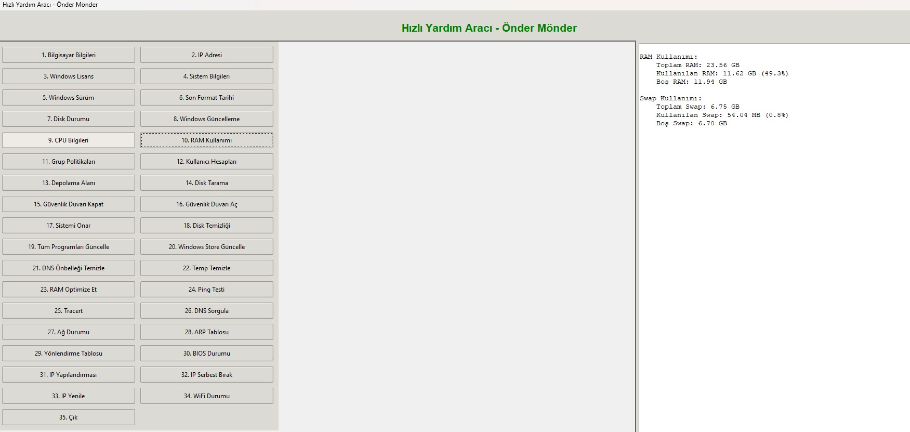

# Windows Sistem Araçları

Windows sistem yönetim ve bakım işlemlerini kolaylaştıran kapsamlı bir GUI uygulaması.


### Ana Ekran

## Özellikler

- Sistem Bilgileri Görüntüleme
- Disk ve RAM Yönetimi
- Ağ Araçları
- Sistem Bakım ve Temizlik
- Windows Servis Yönetimi
- Güvenlik Duvarı Kontrolü

## Kurulum

```bash
# Gerekli modülleri yükleyin
pip install -r requirements.txt

# Programı başlatın
python main.py
```

## Dağıtım

Programı .exe dosyası olarak dağıtmak için:

```bash
pyinstaller --onefile --windowed --icon=app.ico --manifest=manifest.xml --name="Windows Araçları" t.py
```

## Gereksinimler

- Python 3.x
- tkinter
- psutil
- pywin32

## Yönetici Hakları

Bazı özellikler için yönetici hakları gereklidir.

## Lisans

Bu proje MIT lisansı altında lisanslanmıştır.

## Katkıda Bulunma

1. Fork edin
2. Feature branch oluşturun
3. Değişikliklerinizi commit edin
4. Push edin
5. Pull request açın

   Teknik destek için onder7@gmail.com iletişime geçin.
Önder AKÖZ / System & Network Specialist
<div align="center">
**..:: Onder Monder ::..**
*Profesyonel IT Çözümleri*
</div>
---
## 📱 İletişim ve Destek
- 📧 E-posta: [onder7@gmail.com]
- 🌐 GitHub: [github.com/onder7]
- 📞 Destek: [+90 541 411 30 22]

İletişim
--------
Teknik destek için onder7@gmail.com iletişime geçin.
Önder AKÖZ / System & Network Specialist
